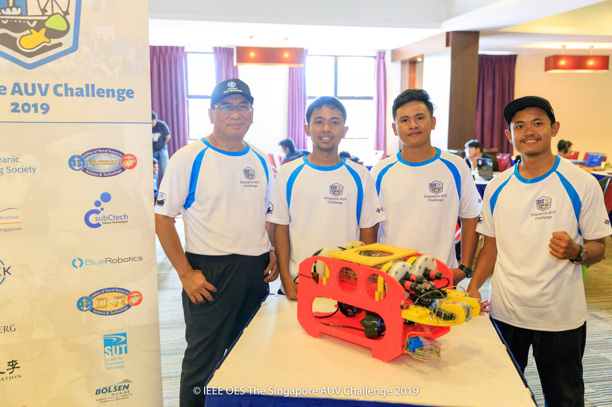
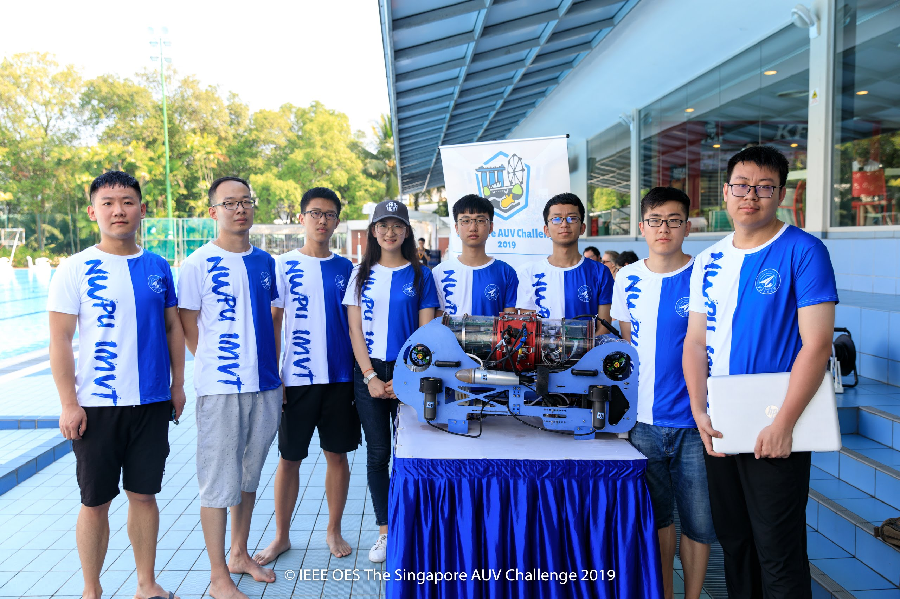
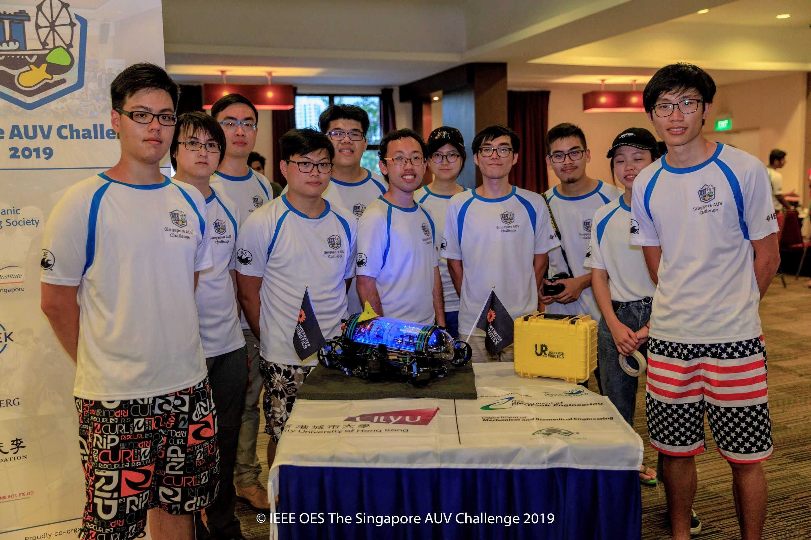
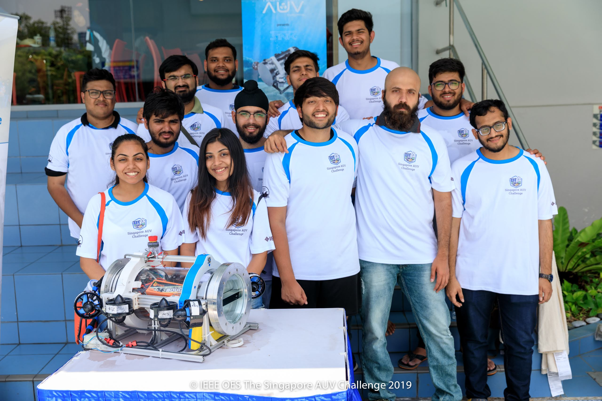

<template id="team-template">
  <tr>
    <td class="team-id"></td>
    <td></td>
    <td></td>
    <td></td>
  </tr>
</template>

<template id="final-team-template">
  <tr>
    <td></td>
    <td class="team-id"></td>
    <td></td>
    <td></td>
    <td></td>
    <td></td>
  </tr>
</template>

<!-- <section id="teams">
  <h3>SAUVC 2019 Winners</h3>
  <ul class="winners">
    <li data-caption="Champion">
      
      
FEFU/IMTP (SAUVC-RU-01)   <a href="https://www.dvfu.ru/en/">Far Eastern Federal University</a>   Vladivostok, Russia

    </li>
    <li data-caption="1st Runner-up">
      
      
N2-AUV(SAUVC-ID-03)   <a href="https://ipb.ac.id/">Bogor Agricultural University</a>   Bogor, Indonesia

    </li>
    <li data-caption="2nd Runner-up">
      
      
Intelligent Marine Vehicle Team (SAUVC-CN-02)   <a href="http://en.nwpu.edu.cn/">Northwestern Polytechnical University</a>   Xi'an, China

    </li>
     <li data-caption="Innovative Engineering Prize">
      
      
CityU Underwater Robotics - Pioneer(SAUVC-HK-02)   <a href="https://www.cityu.edu.hk/">City University of Hong Kong</a>   Hong Kong

    </li>
    <li data-caption="Social Media Prize">
      
      
Team AUV MPSTME (SAUVC-IN-05)   <a href="http://engineering.nmims.edu/" style="font-size: 0.9em">Mukesh Patel School of Technology Management & Engineering</a>   Mumbai, India

    </li>
  </ul>

  

    <input id="collapsible-final" class="toggle" type="checkbox" checked="">
    <label for="collapsible-final" class="lbl-toggle">SAUVC 2019 Qualified Teams</label>
    

      <table class="table-finalists" id="final-teams">
        <tr><th>Final Rank</th> <th>Team ID</th> <th>Team Name</th> <th>Institute</th> <th>Location</th> <th class="team-rank">Qualifiers Rank</th> </tr>
      </table>
    

  

  

    <input id="collapsible-short" class="toggle" type="checkbox">
    <label for="collapsible-short" class="lbl-toggle">SAUVC 2019 Short-listed Teams</label>
    

      <table class="table-teams" id="short-teams">
        <tr><th>Team ID</th> <th>Team Name</th> <th>Institute</th> <th>Location</th></tr>
      </table>
    

  

  

    <input id="collapsible-reg" class="toggle" type="checkbox">
    <label for="collapsible-reg" class="lbl-toggle">SAUVC 2019 Registered Teams</label>
    

      <table class="table-teams" id="reg-teams">
        <tr><th>Team ID</th> <th>Team Name</th> <th>Institute</th> <th>Location</th></tr>
      </table>
    

  

</section> -->
